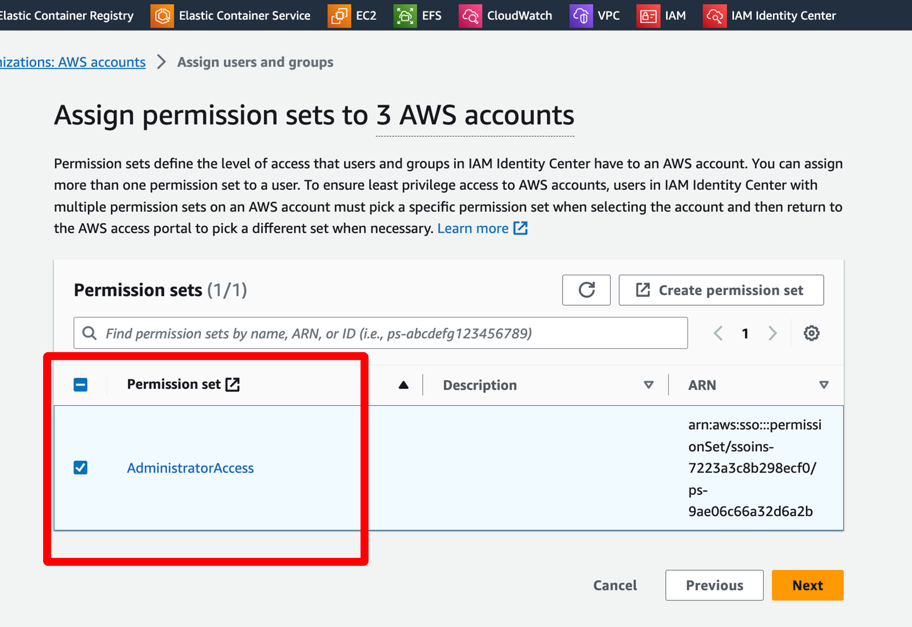
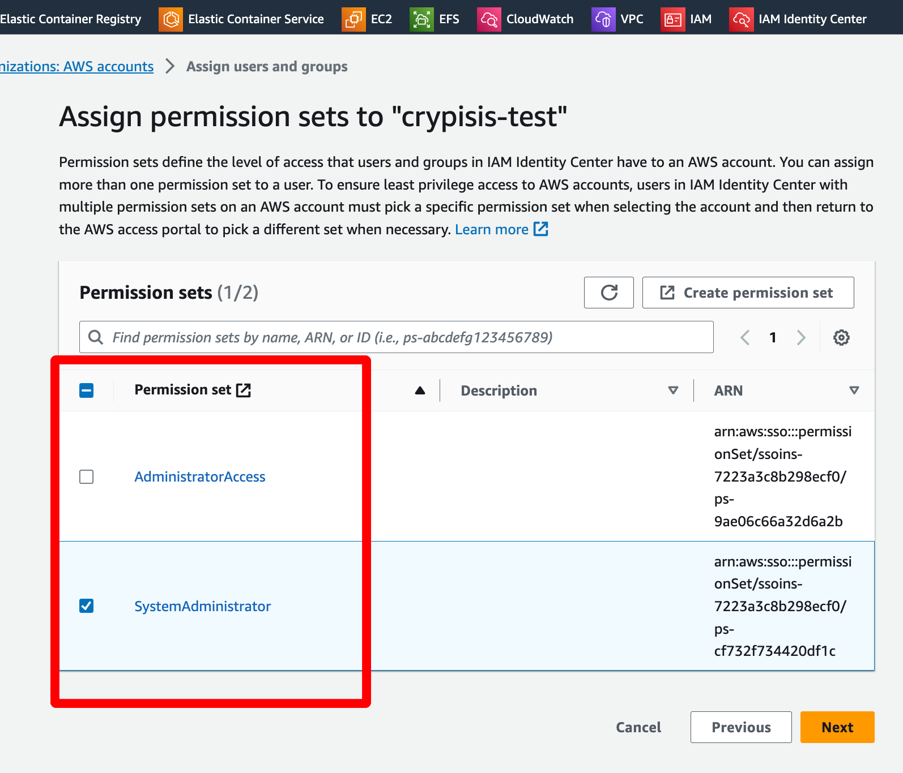

- [Create a standalone AWS account](#create-a-standalone-aws-account)
  - [Payment](#payment)
  - [Verify Identity](#verify-identity)
  - [Support Plan](#support-plan)
- [Access AWS Account with root user](#access-aws-account-with-root-user)
- [Set Up the AWS Account](#set-up-the-aws-account)
  - [Enabling IAM Identity Center](#enabling-iam-identity-center)
- [Administrator Users](#administrator-users)
  - [Create an Administrative Permission Set](#create-an-administrative-permission-set)
  - [Create Administrator User Group](#create-administrator-user-group)
  - [Create Administrator User](#create-administrator-user)
  - [Give Administraive permissions to created User](#give-administraive-permissions-to-created-user)
  - [AWS access portal URL](#aws-access-portal-url)
- [Crypsis Delizziosa Users](#crypsis-delizziosa-users)
  - [Crypsis Delizziosa Account Creation](#crypsis-delizziosa-account-creation)
  - [System Administrator permissions](#system-administrator-permissions)
  - [System Administrator User Group](#system-administrator-user-group)
  - [System Administrator User (dev)](#system-administrator-user-dev)
- [Final Accounts](#final-accounts)
  - [Development Account](#development-account)
  - [Staging Account](#staging-account)
  - [Give System Administor permissions to Crypsis Users](#give-system-administor-permissions-to-crypsis-users)
- [Cost Managing](#cost-managing)
  - [Set up Cost Explorer](#set-up-cost-explorer)
  - [Creating a Budget](#creating-a-budget)

# Create a standalone AWS account
[Reference](https://docs.aws.amazon.com/accounts/latest/reference/manage-acct-creating.html)

* Open the [Amazon Web Services home page](https://aws.amazon.com/).

* Choose *"Create an AWS account"*.

* Enter your account information, and then choose Verify email address. This will send a verification code to your specified email address.

* Enter the verification code, and then choose **Verify**.

* Choose **Business** or **Personal**. Personal accounts and business accounts have the same features and functions.

* Enter your company or personal information.

## Payment

* Enter the information about payment method, and then choose Verify and Continue.

## Verify Identity

* To Verify the Identity add the phone number so a SMS can be sent with a verification code.
* Enter the verification code and press Continue

## Support Plan
* If desired select a support plan to have access to AWS support (not needed)

* Complete Sign Up

# Access AWS Account with root user

* Click on "Go to AWS Console" or go to [this link](https://console.aws.amazon.com/console/home)

* Enter root user email adress

* Enter passowrd for root user

# Set Up the AWS Account

[Reference](https://docs.aws.amazon.com/streams/latest/dev/setting-up.html)

Instead of working with the root user we will create different sets of users with different premissions and use the root user only when needed. [This are the actions that require root access](https://docs.aws.amazon.com/IAM/latest/UserGuide/root-user-tasks.html).
The tool for managing of this users is the **"IAM Identity Center"**. To use it we will first have to enable it.

<!-- 
## Create User Group

* Open the IAM console by searching for it in the finder or by accessing [this link](https://console.aws.amazon.com/iam/)

* Choose *"User Groups"*, and then choose "*Create New Group*"

* Set "*User group name*" to `Administrators`
* In the *"Attach permissions policies"* section select the `AdministratorAccess` policy
* Scroll down and click on *"Create group"*

## Create User

Now that the group is created let's create a User and add it to the group.

[REFERENCE](https://docs.aws.amazon.com/IAM/latest/UserGuide/id_users_create.html)

* Go to the "*Users*" section on the left menu and select "*Create User*"

* Check the "*Provide user access to the AWS Management Console*" box and leave it to "*Specify a user in Identity Center*" and clickon "*Next*"

This will open a pop-up to go to the "Manage Identity Center".

 -->

## Enabling IAM Identity Center
[Reference](https://docs.aws.amazon.com/singlesignon/latest/userguide/get-started-enable-identity-center.html)

Search for the IAM Identity Center in the resource finder.

Proceed and click on "*Enable*" and "*Create AWS organization*"

# Administrator Users

We will now create and **Aministrator user** that will be used by you to **manage the account without using the root user.**
To do so we will start by creating an Admistrative Permission set, then an Admisitrator Users group and create a user in that group, finaly we will give the Administrative Permission set to the Administrator Users group so all users in that group have the administrative permissions.

## Create an Administrative Permission Set

[Reference](https://docs.aws.amazon.com/singlesignon/latest/userguide/permissionsetsconcept.html)
[Reference](https://docs.aws.amazon.com/singlesignon/latest/userguide/get-started-create-an-administrative-permission-set.html)

In order to give users certain permisions we will be using "Permission sets". Permission sets are stored in IAM Identity Center and define the level of access that users and groups have to an AWS account. Perform the following steps to create a permission set that grants administrative permissions.

* In the "IAM Identity Center" console, under **"*Multi-account permissions*"** choose **"*Permission sets*"**

* Click **"*Create permission set*"**

* In the "*Permission set type*" leave it as **"*Predefined permission set*"** and **select `AdministratorAccess`** and click *"Next"*

* In the "*Specify permission set details*" page, keep the default settings and choose "*Next*"

* Review and Create permission set

## Create Administrator User Group
[Reference](https://docs.aws.amazon.com/singlesignon/latest/userguide/addgroups.html)

User Groups allow to manage permissions on several users. We will now create a user group for administor users.

* Select **"*Groups*"** from the left menu of the *"IAM Identity Center console"*

* Set **"*Group name*" to `Administrators`**

* Add description if desired

* Click *"Create Group"*

## Create Administrator User
[Reference](https://docs.aws.amazon.com/singlesignon/latest/userguide/addusers.html)

To create an administrator user and add it to the created group follow this steps:

* Select **"*Users*"** from the left menu of the *"IAM Identity Center console"* and *"Add User"* 

* Fill in the following information 
  * email adress: Input the email adress of the administrator user, this email will be used by you to access the AWS account as an administrator
  * First name: Input the Administrator First Name
  * Last name: Input the Administrator First Name
  * Display name: Choose a display name for the Administrator User

* Leave the optional fields unset and click on "*Next*"
* Add the user to previously created `Administrators` group
* Review and click *"Add user"*
  

This will send a verification link to the email adress to verify the account and set a password.

## Give Administraive permissions to created User
[Reference](https://docs.aws.amazon.com/singlesignon/latest/userguide/get-started-assign-account-access-admin-user.html)

We will now give the `AdministratorAccess` permission set to all the users in the `Administrators` group, including the one created in the previous section.

* Under "*Multi-account permissions*" choose "*AWS accounts*"

* Select the root user created in [first section](#create-a-standalone-aws-account) and click on "Assign users or groups"

* Select the `Administrators` group previously created and click on *"Next"*

* On *"Permission sets"* select the `AdministratorAccess` created.

* Review and click on *"Submit"*

## AWS access portal URL
[Reference](https://docs.aws.amazon.com/singlesignon/latest/userguide/get-started-sign-in-access-portal.html)

In the left menu of *"IAM Identity Center console"* go to **Settings** and copy the `AWS access portal URL` from the *"Identity source"* section

This link is the one that will be used for the users (us) to access the account by entering the user name and the password set by the user in the verification email.

# Crypsis Delizziosa Users

For security reasons we will create a users without administrator permissions that is able to manage servers and databases. This kind of users are also known as System Administrator users.

This users will be managed by a new Crypsis Delizziosa Account.
To create them we will follow similar steps as [Administrator Users section](#administrator-users)

## Crypsis Delizziosa Account Creation

* In the AWS Console search for **"*AWS Organizations*"**

* Click on **"*Add an AWS account*"**

* Set **"*AWS account name*" to `Crypsis Delizziosa`**
* Set **"*Email address of the account's owner*" to `crypsisdelizziosa@gmail.com`**

* Click on "*Create AWS account*". This process may take a few minutes

## System Administrator permissions
[Reference](https://docs.aws.amazon.com/singlesignon/latest/userguide/get-started-create-permission-set-to-grant-least-privilege-permissions.html)

To create System Administrator for the new users will follow the same steps as in the [Create an administrative permission set](#create-an-administrative-permission-set) section but select `SystemAdministrator` as the "Policy for predefined permission set"
[Here you can find a detailed description of the permissions given to the permission sets](https://docs.aws.amazon.com/IAM/latest/UserGuide/access_policies_job-functions.html)

* Under "*Multi-account permissions*" choose "*Permission sets*"

* Click "*Create permission set*"

* In the "*Permission set type*" leave it as "*Predefined permission set*", select `SystemAdministrator` and click *"Next"*

* In the "*Specify permission set details*" page, keep the default settings and choose "*Next*"

* Review and Create permission set

## System Administrator User Group
[Reference](https://docs.aws.amazon.com/singlesignon/latest/userguide/addgroups.html)

We will now create a User group to manage all the System Administrator users. To do so we will followe the same steps as in the [Create Administrator User Group section](#create-administrator-user-group)

* Select **"*Groups*"** from the left menu of the *"IAM Identity Center console"*

* Set **"*Group name*" to `System Administrators`**

* Add description if desired

* Click *"Create Group"*

## System Administrator User (dev)

[Reference](https://docs.aws.amazon.com/singlesignon/latest/userguide/addusers.html)

To create an administrator user and add it to the created group follow this steps:

* Select **"*Users*"** from the left menu of the *"IAM Identity Center console"* and *"Add User"* 

* Fill in the following information 
  * email adress: `crypsisdelizziosa@gmail.com`
  * First name: Crypsis
  * Last name: Delizziosa
  * Display name: Crypsis Delizziosa

* Leave the optional fields unset and click on "*Next*"
* Add the user to previously created `Administrators` group
* Review and click *"Add user"*
  

This will send a verification link to the email adress to verify the account and set a password.

# Final Accounts
In order to isolate the development, staging and production environments we will be creating a set of additional accounts to totally separate the resources of each environment. This will be done by creating 2 new accounts, a development and a staging one, that will be accessed by the administrator users and the system administrator users.

To create this accounts we will be using the **same email as the root user** but with small changes. We will be using a new tab of the AWS console, the **"*Organization*"** tab. To open it click on the user name to unfold a menu and select `Organization`

## Development Account
* To create the development account click on ***"Add an AWS account"*** and fill in the following information:
  * AWS account name: `Development`
  * Email address of the account's owner: Here we will use the **same email as the root user but add `+development` right before the `@`**. For example if the root user email was `root-user-email@domain.com` we will now use `root-user-email+dev@domain.com`. This is an AWS feature that lets us use the same email for different accounts to have the resources separated as we want now.

  
  * Leave IAM role name as it is and click on **"*Create AWS Account*"**

## Staging Account
* To create the staging account click on ***"Add an AWS account"*** and fill in the following information:
  * AWS account name: `Staging`
  * Email address of the account's owner: Here we will use the **same email as the root user but add `+staging` right before the `@`**. For example if the root user email was `root-user-email@domain.com` we will now use `root-user-email+stage@domain.com`. This is an AWS feature that lets us use the same email for different accounts to have the resources separated as we want now.

  
  * Leave IAM role name as it is and click on **"*Create AWS Account*"**

## Give System Administor permissions to Crypsis Users
[Reference](https://docs.aws.amazon.com/singlesignon/latest/userguide/get-started-assign-account-access-admin-user.html)

We will now give the `SystemAdministrator` permission set to all the users in the `System Administrators` group, including the ones created in the previous sections.

* Under "*Multi-account permissions*" choose "*AWS accounts*"

* Select the root user created in [first section](#create-a-standalone-aws-account) and click on "Assign users or groups"

* Select the `Administrators` group previously created and click on *"Next"*

* On *"Permission sets"* select the `AdministratorAccess` created.

* Review and click on *"Submit"*

# Cost Managing
[Reference](https://saturncloud.io/blog/setting-amazon-aws-billing-limits-what-you-should-know/)
[Reference](https://docs.aws.amazon.com/cost-management/latest/userguide/budgets-managing-costs.html)

Currently, AWS does not provide a built-in feature to set hard billing limits, however AWS provides several tools and strategies for managing your expenditure and avoiding the dreaded bill shock.

We will first set up a [Cost Explorer](https://aws.amazon.com/aws-cost-management/aws-cost-explorer/) to visualize, understand, and manage the AWS infrastructure costs and usage over time. Then we will create a [Budget](https://aws.amazon.com/aws-cost-management/aws-budgets/) to set up alerts when we exceed certain thresholds.

**To perform this actions we need to log with the root user created in** [the first section](#create-a-standalone-aws-account)

## Set up Cost Explorer

## Creating a Budget
We will now create a Budget that notifies us if we exceed, or are forecasted to exceed, the budget amount.

* With the root user, click on the user name to unfold a menu and select `Billing Dashboard`

* Under *"Cost Management"* on the left menu select *"Budget"* Monthly cost budgets and then *"Create a budget"*

* Use a "User Template" and select ***"Monthly cost budget"***

* **Set the budget name, monthly budget and email adresses to send the alert to.** And click on *"Create budget"*

This has created a budget plan that will notify us when 
* The spend reaches 85% of the plan
* The actual spend reaches 100%
* The forecasted spend is expected to reach 100%.

For more information about budgets visit [the official user guide](https://docs.aws.amazon.com/cost-management/latest/userguide/budgets-managing-costs.html)